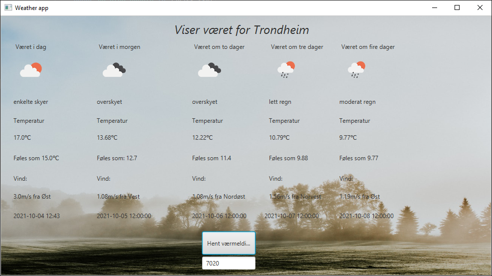

Dette prosjektet er mitt største prosjekt utenfor studiet. 
Programmet er skrevet i Java med JavaFX som GUI. 
Værdataen er hentet fra https://openweathermap.org/ som tilbyr gratis vær-API. 
 Hovedformålet med denne appen var å lage noe på egenhånd, og å lære meg å hente ut data fra et API.
Værdata hentes på JSON-format. 

For å hente værmelding skriver man ganske enkelt inn postnummer.

